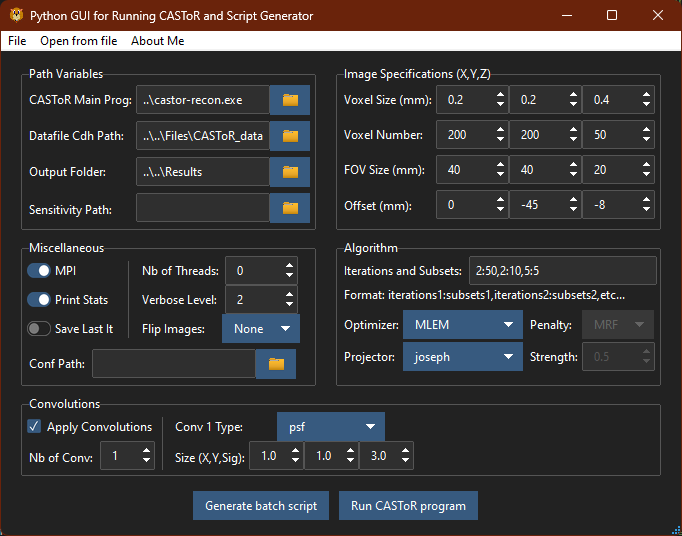

<!-- <a name="readme-top"></a> -->
<!-- Table of Contents -->
<details>
<summary>Table of Contents</summary>

- [CASToR Reconstruction for HiRezBrainPET](#castor-reconstruction-for-hirezbrainpet)
  - [Content](#content)
    - [*BPET\_castor\_v3.1.1* folder](#bpet_castor_v311-folder)
    - [*BPET\_castor\_results* folder](#bpet_castor_results-folder)
  - [Getting Started](#getting-started)
    - [Pre-requisites](#pre-requisites)
    - [Installation](#installation)
  - [How to use](#how-to-use)
    - [CASToR Source code](#castor-source-code)
    - [Results - Python scripts - Data Conversion/Processing](#results---python-scripts---data-conversionprocessing)
    - [Results - Exectuables - Data Conversion/Processing](#results---exectuables---data-conversionprocessing)
      - [castor-PETScannerLutEx\_BPET.exe](#castor-petscannerlutex_bpetexe)
      - [castor-scannerLUTExplorer.exe](#castor-scannerlutexplorerexe)
      - [castor-txtConversionCrystalsID\_BPET.exe](#castor-txtconversioncrystalsid_bpetexe)
      - [castor-datafileConversionEx\_BPET.exe](#castor-datafileconversionex_bpetexe)
      - [Batch scripts with examples](#batch-scripts-with-examples)
    - [Results - Main program - Reconstruction](#results---main-program---reconstruction)
      - [Main Parameters](#main-parameters)
      - [Python CASToR Batch GUI](#python-castor-batch-gui)
  - [Warning](#warning)
  - [License](#license)

</details>

<!-- END Table of Contents -->

<!-- CASToR Reconstruction for HiRezBrainPET -->
# CASToR Reconstruction for HiRezBrainPET

[CASToR](https://castor-project.org/) is an open source software for tomographic reconstruction, developed by the LaTIM laboratory in France, which stands for Customizable and Advanced Software for Tomographic Reconstruction. With flexibility, modularity and generic programming in mind, the main aim is creating a frame work for developing and testing new reconstruction methods and algorithms.

This repository contains modifications to the code and new the scripts to run the reconstruction program for the HiRezBrainPET system, an innovative PET scanner that uses RPC as detectors. The [first results](https://arxiv.org/abs/2211.05860) were published in November 2022 by Paulo Fonte et al. using a simple reconstruction process. Thus, the goal with this is to make that process more generic and customizable to the system, and allowing a more flexible and scalable tool for researchers in the field of medical imaging, or even the broader public, to use and replicate the results. All of this in a more efficient and easier way for the development, implementation and testing.

## Content

The project consists of 2 main folders, the main source code of the CASToR project with the modifications needed to account for the HiRezBrainPET system, ``BPET_castor_v3.1.1``, and python program, the batch scripts and the graphical user interface (using tkinter from python) to run the program for the HiRezBrainPET system, `BPET_castor_results`.

### *BPET_castor_v3.1.1* folder

The main changes lie in the `toolkits` folder, which consist of the CASToR utilities that helps of the data processing. The ones relevant and modified/created are:

- `castor-PETScannerLutEx_BPET.cc` - The main program to create Look-Up-Table (LUT) files (.lut) that represents any scanner geometry, like the HiRezBrainPET system
- `castor-scannerLUTexplorer.cc` - A program to visualize the LUT file content, exploring the central positions and orientation of the approximated system crystal, element by element.
- `castor-txtConversionCrystalsID_BPET.cc` - A program to convert the LOR coordinates to the crystal indexation in the scanner geometry. It returns a similar txtfile with the format t, id1, id2, where t is the time of detection, and id1 and id2 are the crystal id of both intersection points, instead of the x, y, z coordinates.
- `castor-datafileConversionEx_BPET.cc` - A program to convert the txt file to the CASToR format.

Its with these programs that the data is prepared to be used in the main reconstruction program, `castor-recon.cc`.
After one needs to compile the project, following the instructions in section [Results - Main program - Reconstruction](#results---main-program---reconstruction).

### *BPET_castor_results* folder

Here we have a **configuration** folder, which can be deprecated if the one used in the build folder, BPET_castor_v3.1.1, is used.

Additionally, we have a **Release** folder with the the executables of the programs, including the main reconstruction program, `castor-recon.exe`, as well as the batch files to run the programs with the correct parameters. There are several batch files to run the main program, all with the same purpose, named as `runmpi_2024Derenzo_win{}.bat`, where the {} is the number of a certain test for specific parameters.
In addition, there is a subfolder **batch_python** with a code for a graphical user interface (GUI) using tkinter, that creates the batch files given the user input, that can be saved and run the reconstruction program with the corresponding parameters.

Finally, there is a **python** folder with the scripts to process the data of the results, that adapt the data to the format of the reconstruction program, and to visualize the results in a more intuitive way. The instructions on how to use the scripts are in the [Python CASToR Batch GUI](#python-castor-batch-gui) section.

## Getting Started

### Pre-requisites

For the python scripts, it is compatible with all operating systems that support Python 3.11 or above.

As for the compilation of the CASToR source code, it is necessary to have the following installed:

- CMake 3.21 or newer
- .NET Core 8.0 or newer - for Windows
- MSVC 2015 (Visual Studio) or newer - for Windows
- GCC 4.8 or newer - for Unix-based systems
- If using MPI (Message Passing Interface) for parallel processing, it is necessary to have the MPI library installed, both the standalone executables and the SDK installers.

An example of the paths needed to be added/check in the environment variables, in Windows:

- `C:\Program Files\CMake\bin` - CMake
- `C:\Program Files\Microsoft Visual Studio\2022\Community\MSBuild\Current\Bin` - MSVC
- `C:\Program Files\Microsoft MPI\Bin` - MPI
- `C:\Program Files (x86)\Microsoft SDKs\MPI\Include\` - MPI
- `C:\Program Files (x86)\Microsoft SDKs\MPI\Lib\x64\` - MPI
- `C:\Program Files (x86)\Microsoft SDKs\MPI\Lib\x86\` - MPI
- `C:\Program Files\dotnet\` - .NET Core

### Installation

Starting with the python scripts, it is necessary to install the requirements in the `requirements.txt` file, found in the python subfolder of the BPET_castor_results folder. This can be done with the following command:

```bash
pip install -r requirements.txt
```

As for the CASToR source code, a guide can be found in section 3 of the CASToR Documentation, [here](https://castor-project.org/documentation_v3). The main steps though are:

Create a build folder in the root of the project and run cmake to build the project, using the following commands:

```bash
mkdir build
cd build
cmake ..
```

Alternatively, one can use the **CMake GUI**, `cmake-gui` to configure the build, selecting the source code folder and the build folder, and then clicking on the `Configure` button. After that, one can click on the `Generate` button to create the build files using the either the MSVC or the GCC compiler or even other compiler depending on the operating system.

Once created the makefile for the compiler, one can run the following command to compile the project, in case of using the GCC compiler:

```bash
make
```

If using the MSVC compiler, one can open the solution file created in the build folder, and build the project using the Visual Studio IDE. Make sure to build the project in Release mode, to have the best performance.
However, there is a way to compile the project directly in the command line, using the msbuild command, as follow:

```bash
msbuild CASTOR.sln /p:Configuration=Release /t:ALL_BUILD
```

where the `/p:Configuration=Release` flag is to build the project in Release mode, and the `/t:ALL_BUILD` flag is to build all the targets in the project. Other target projects can be available to build, which can be seen in the build folder.

## How to use

### CASToR Source code

Here there are several changes that can be done to the source code to adapt to the HiRezBrainPET system, depending on what is needed.

The main changes currently made are in the `toolkits` subfolder, as mention in section [Content](#content), with the creation/adaptation of the programs: `castor-PETScannerLutEx_BPET.cc`, `castor-txtConversionCrystalsID_BPET.cc` and `castor-datafileConversionEx_BPET.cc`.

Beyond the creation and adaption of tools to process the data, CASToR also allows the creation of new modules, by building specific classes that inherits from more abstract classes. In CASToR [website](https://castor-project.org/documentation_v3), there are guides on how to create new modules, as well as specific documentation for specific type of classes, like:

- image convolver (such as PSF model)
- image processing
- projectors
- optimizers and penalizers
- dynamic models, etc...

All of this module added in both source (src) and header (include) folders.

As for the main program, `castor-recon.cc`, it can also be adapted, although it is not very recommended, as it is the main program that runs the reconstruction process. However, it is possible to add new parameters to the program, or even new options to the program, by adding new flags to the program, and then adapting the code to read and use these flags.

> **IMPORTANT:** After each change in the source code, it is necessary to recompile the project, as mentioned in the [Installation](#installation) section. For example, if a toolkit is changed/created, it is necessary to recompile the project to have the new executable of that program (In case of the creation of a new program, the CMakeList.txt file must be updated to include the new program in the build process).

### Results - Python scripts - Data Conversion/Processing

Within the python subfolder, there are several scripts for processing the data of the results, that include part of the adaption of the data to the format of the reconstruction program, and to visualize the results in a more intuitive way.

The data is not public, as it is part of the results of the HiRezBrainPET system, but the scripts can be used with any data that has the same format. In this case the data consist on a `.mat` file, which contains a structure with the lines of detection corresponding to each event, in a parametric  representation, their time of detection and other parameters not relevant for reconstruction.

The main scripts are:

- `line_intersection` folder - containing python functions, like `intersect_line_cylinder.py`, that calculates the intersection of a line with a cylinder. It takes as input the point and direction of the line (taken from the .mat file), and the radius and height of the cylinder, and returns the two  intersection points array, if they exist, or None if they don’t. The function also has optional flags input if the user want to show the line and cylinder, and to print messages, which can be useful to check if the function is working properly.
- `Intersect_LOR.py` - a script that transforms the datafile given into fractions with the time and coordinates of the points of intersection with the cylinder, and saves the data in a txt file with the format t, x1, y1, z1, x2, y2, z2, where x1, y1, z1 are the coordinates of the first point of intersection, x2, y2, z2 are the coordinates of the second point of intersection, and t is the time of detection.
- `LoadSave_TimeLORs` - This scripts does part of the work of the `Intersect_LOR.py`, loading the data from the .mat file and saving the times and LORs, before the intersection, into .npy files.
- `combine_files.py` - a script that combines the fraction data into a single txt file `LOR_all_points_time.txt`.
- `load_mat.ipynb` - a jupyter notebook that loads the data from the .mat file and shows the structure of the data, for interpretation of the data. Includes also a analysis of the data, a histogram of the data frequency over time, allowing to obtain the exponential decay of the data. Which can be related to the activity of the source (like for example, obtain the half-life of the source).

To use the python scripts, open a terminal window and run the following command:

```bash
python .\[name_program].py
```

### Results - Exectuables - Data Conversion/Processing

The conversion of the data to the format of the reconstruction program is completed with the executables in the Release folder, as detailed in the [Content](#content) section, the toolkits compiled from the source code in the BPET_castor_v3.1.1 folder. The main programs then:

#### castor-PETScannerLutEx_BPET.exe

First step is to create Look-Up-Table (LUT) files (.lut) that represents any scanner geometry, like the HiRezBrainPET system. This program helps with that, in case the scanner geometry wanted is not in the config/scanner folder.

The program is called with the alias of the name that the user wants to give to the .lut file as an argument, and additional options to define some scanner parameters, like for example the radius, the number of rsectors, the number of crystals transaxially and axially, and others, if not provided it will use default values. In order to run the program open a terminal window and run the following command:

```bash
.\castor-PETScannerLutEx_BPET.exe -alias [name_lut_file] -radius [value] -nbrsectors [value] -nbcrystals [value1,value2] -sizecrystals [value1,value2,value3] -defaultdim [value1,value2] -defaultfov [value1,value2] -minangle [value] -startangle [value]
```

If want to know the default values, open the help menu (-h,-help,--help). This will then generate two files:

- A binary file containing the cartesian coordinates (x, y, z) of the center of each crystal, as well as their orientation unit vector (u_x, u_y, u_z), corresponding to the angular orientation;
- A header file about the system information, with some mandatory and optional information fields.

#### castor-scannerLUTExplorer.exe

Program that helps explore the LUT file content, exploring the central positions and orientation of the approximated system crystal, element by element. It is useful to check if the LUT file is correct, and if the system is well represented.

To run the program, open a terminal window and run the following command:

```bash
.\castor-scannerLUTExplorer.exe -sf [scanner_alias].hscan -e
```

This will print the central positions and orientation in the terminal, element by element, by choice of the user. Other flags are available, print the help menu to see the options (-h,-help,--help).

#### castor-txtConversionCrystalsID_BPET.exe

Before the final step of the conversion into CASToR format, it is necessary to convert the LOR coordinates to the crystal indexation in the scanner geometry (thus needing the programs before to ensure that we have a correct scanner geometry representation). It returns a similar txtfile with the format t, id1, id2, where t is the time of detection, and id1 and id2 are the crystal id of both intersection points, instead of the x, y, z coordinates.

The program is called with the txt file to convert, the scanner alias name for the system geometry, and the output file name. To run it, open a terminal window and run the following command:

```bash
.\castor-txtConversionCrystalsID_BPET.exe -txt [filename].txt -sf [scanner_alias] -o [output_filename].txt
```

This conversion may take some time, depending on the size of the txt file, as well as the number of elements in the scanner geometry. A progress bar is shown in the terminal, to visualize the progress of the conversion.

#### castor-datafileConversionEx_BPET.exe

As the final step of the conversion, this program converts the txt file into the CASToR format.

It is called with the txt file to convert in list-mode format, the scanner alias name for the system geometry, the output file name, as well as other options, like the isotope name and the verbose value, if not provided it will use default values. Other options are available, print the help menu to see the options (-h,-help,--help), like normalization, randoms, scatter factors files.
To run it, open a terminal window and run the following command:

```bash
.\castor-datafileConversionEx_BPET.exe -il [filename].txt -s [scanner_alias] -o [output_filename] -ist [isotope_name] -vb [verbose_value]
```

#### Batch scripts with examples

In the Release folder, there are several batch files that runs these programs with certain parameters for the data conversion.

- lut_compiler.bat - compiles the castor-PETScannerLutEx_BPET.cc program
- lut_explorer.bat - runs the castor-scannerLUTExplorer.exe program
- txt_id_conversion.bat - runs the castor-txtConversionCrystalsID_BPET.exe program
- data_conversion_to_castor.bat - runs the castor-datafileConversionEx_BPET.exe program

### Results - Main program - Reconstruction

After the data is converted to the CASToR format, one can start using the main program of reconstruction, `castor-recon.exe`. To know the available parameters of the program, one can print the help menu (-h,-help,--help).

The parameters are all combine in a batch file to run, `runmpi_2024Derenzo_win{}.bat`, where the {} is the number of a certain test for specific parameters. Thus running the batch file in the terminal, it will run the program with the parameters given in the file:

```bash
.\runmpi_2024Derenzo_win{}.bat
```

To use the program in a Unix-based system, one can adapt the batch file to a shell script, and run it in the terminal with the following command:

```bash
sh runmpi_2024Derenzo_unix{}.sh
```

#### Main Parameters

The main parameters of the program used are:

- `-df`: the input CASToR datafile header.
- `-dout`: the name of the output directory.
- `-sens`: optional use of existing sensitivity file.
- `-dim`: the number of voxels of the reconstructed image in each dimension x,y,z.
- `-vox`: the size of the voxels in mm in each dimension x,y,z.
- `-fov`: the size of the field-of-view in mm in each dimension x,y,z.
- `-off`: offset applied to the reconstructed field-of-view in mm in each dimension x,y,z.
- `-it`: define the number of sequence of iterations and subsets separated by commas - its1:subs1,its2:subs2,etc...
- `-opti`: optimization algorithms chosen.
- `-proj`: the projection algorithm.
- `-conv`: apply a convolution kernel to the projection data. To use a gaussian kernel, it is necessary to give the X1mm transaxial and X2mm axial FWHM with X3 sigmas in the convolution kernel - gaussian,1.,1.,3.::psf.
- `-th`: parallel computation using the OpenMP library.
- `-vb`: general verbose level.
- `-conf`: give the path to the CASToR configuration directory, if not use default.
- `-flip-out`: flip the image along an axis before saving.

#### Python CASToR Batch GUI

In the batch_python subfolder, there is a code for a graphical user interface (GUI) using tkinter, that creates the batch files given the user input, that can save and run the reconstruction program with the corresponding parameters in an interactive way.

To run the GUI, open a terminal window and run the following command:

```bash
python .\python_castor_batch.py
```

Here is a screenshot of the GUI:



The GUI allows the user to input:

- Paths for the main program, the Cdh datafile (in CASToR format), the output directory for the results of the reconstruction, and optionally the path for sensitivity file, and the configuration directory if wanted.
- Choose to use MPI for parallel computation, and the number of threads to use, the verbose level of the program when output in the terminal, as well as the option to print the some stats about the iteration image saved, the option to save only the last iteration image, and the option to flip the image along a certain axis before saving.
- The number of voxels of the reconstructed image in each dimension x,y,z, the size of the voxels in mm in each dimension x,y,z, the size of the field-of-view in mm in each dimension x,y,z, and the offset applied to the reconstructed field-of-view in mm in each dimension x,y,z. Since the voxel size, voxel number and field-of-view are related, the user can choose to change one of them, and the others will be updated accordingly.
- The number of sequence of iterations and subsets separated by commas like the example bellow, the projection algorithm, the optimization algorithms chosen, and the penalty option and strength, if the optimizer requires it.
- Finally, the option to apply a certain number of convolution kernels to the projection data, for each the type, as well as the FWHM in mm in the transaxial, axial direction and the number of sigmas in the convolution kernel.

After the user input all the parameters, the GUI can create a batch file with the parameters given, and save it in the program folder. The user can then run the batch file in a terminal, to run the reconstruction program with the parameters given.

If one wants to use an existing batch file created by the GUI, one can run use the "Open from file" option in the top left, and select the batch file to use, updating the parameters in the GUI.

## Warning

There some warnings to take into account when using the program:

- There are 2 config folders, one in the BPET_castor_results folder, and one in the BPET_castor_v3.1.1 folder. The one that is associated with the build folder is the one in the BPET_castor_v3.1.1 folder. Thus, if the user wants to use a different config folder, it is necessary to add that option when running the main program with the `-conf` flag.
- The program is not optimized for all systems, and may take a long time to run, depending on the number/size of voxels, the convolutions used, and others. It is recommended to check for a given set of parameters, and for a given CPU power, the time it takes to run the program. In particular, the program starts by computing the sensitivity matrix, which is a time consuming demanding task, where a progress percentage is shown in the terminal. If this value takes too long to progress (like 1% per 5 minute), it is recommended to stop the program and check a way to reduce the time of computation.
  - The use of MPI can help with it, not forgetting to choose the number of threads to use.

## License

[MIT](https://choosealicense.com/licenses/mit/)
